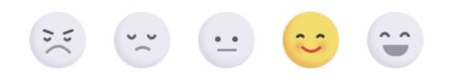

# Lit-Emojis
Web Component implementation of animated emojis.

## Ontology
Original design by Mohammad Amiri
https://dribbble.com/shots/4793955-Feedback-Reactions

Which was then 'Rebounded' by Aaron Iker
https://dribbble.com/shots/9828547-Feedback-Reactions

In his post, Aaron kindly included a Codepen link with a live implementation
https://codepen.io/aaroniker/full/mdyYBPP

Finally, I refactored and tweaked it into a Web Component.